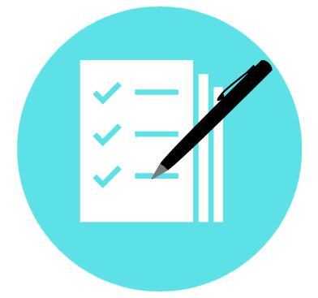
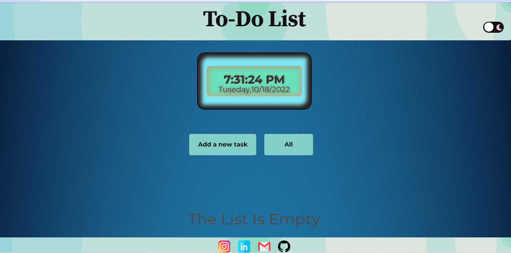

# 📝 To-Do List App

A simple and minimal To-Do List application to help you manage your daily tasks and stay organized.

## 🚀 Features

- Add new tasks
- Mark tasks as complete
- Delete tasks
- User-friendly interface

## 😎 Our Logo `<a name = "logo"></a>`



## 📸 Demo




## 🛠️ Tech Stack

- HTML
- CSS
- JavaScript

## 📦 Installation

Clone the repository:
   ```bash
   git clone (https://github.com/Anviksh/daily-tasks)
   
   ```
Build the Docker image: docker build -t `<your-image-name>` .

Run the container: docker run -d -p 8080:80 `<your-conatainer-name>`

You can access your website at: `http://localhost:8080`


## 🧑‍💻 Usage

- Type a task into the input field and click "Add" to include it in the list.
- Click the checkbox to mark a task as completed.
- Click the delete icon to remove a task.


## 🧾 License

This project is licensed under the MIT License.

## 🙌 Acknowledgements

Inspired by basic task manager apps and productivity tools.
